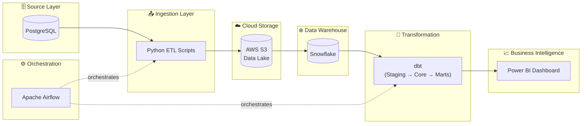
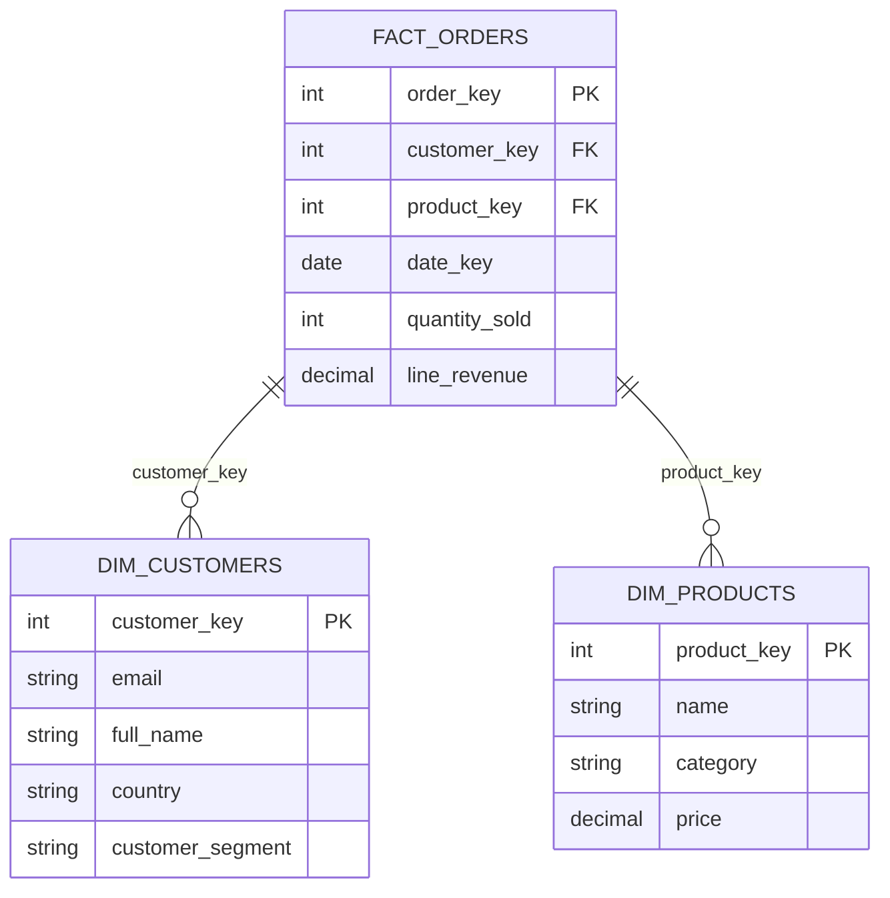

<p align="center">
  
  
  
  
  
  
  
</p>

# 🛒 ShopStream - Modern Cloud Data Pipeline

A **production-ready data engineering project** demonstrating a complete end-to-end cloud data pipeline for e-commerce analytics. Built with the Modern Data Stack.

---

## 📊 Architecture Overview



---

## ✨ Features

- 🔄 **Automated Data Generation** — Realistic e-commerce data using Faker
- ☁️ **Cloud-Native Architecture** — AWS S3 data lake with partitioned storage
- ❄️ **Snowflake Data Warehouse** — Scalable cloud DWH with staging tables
- 📐 **Dimensional Modeling** — Star schema with dbt (dimensions, facts, marts)
- 📊 **Business Intelligence** — Power BI dashboard for sales analytics
- ⚙️ **Orchestration** — Apache Airflow DAG for automated pipelines
- 🐳 **Docker Ready** — One-command setup with Docker Compose

---

## 📊 Power BI Dashboard

### Vue d'ensemble (Overview)


### Analyse Clients (Customer Analysis)


## 🚀 Quick Start

### Option 1: Docker (Recommended)

```bash
# Clone the repository
git clone https://github.com/yourusername/shopstream.git
cd shopstream

# Start all services
docker-compose up -d

# Access Airflow UI
open http://localhost:8080  # admin/admin
```

### Option 2: Manual Setup

```bash
# 1. Create Python virtual environment
python -m venv venv
source venv/bin/activate  # Windows: venv\Scripts\activate
pip install -r requirements.txt

# 2. Configure environment
cp .env.example .env
# Edit .env with your credentials

# 3. Create PostgreSQL database and tables
psql -U postgres -c "CREATE DATABASE shopstream;"
psql -U postgres -d shopstream -f scripts/schema.sql

# 4. Generate sample data
python scripts/generate_data.py

# 5. Export to S3
python scripts/export_to_s3.py

# 6. Run dbt transformations
cd dbt_part/shopstream_dbt
dbt run
```

---

## 🏗️ Project Structure

```
shopstream/
│
├── 📜 scripts/                         # Python & SQL Scripts
│   ├── schema.sql                      # PostgreSQL schema (6 tables)
│   ├── generate_data.py                # Generate sample e-commerce data
│   ├── export_to_s3.py                 # Export PostgreSQL → S3
│   ├── snowflake_setup.sql             # Complete Snowflake setup (DB, schemas, tables)
│   ├── snowflake_copy_into.sql         # Snowflake COPY INTO commands
│   └── snowflake_verify_data.sql       # Data verification queries
│
├── 🔄 dbt_part/                        # dbt Transformation Project
│   └── shopstream_dbt/
│       ├── models/
│       │   ├── staging/                # stg_orders
│       │   ├── core/                   # dim_customers, dim_products, fact_orders
│       │   └── marts/                  # mart_sales_overview, mart_customer_ltv, mart_product_performance
│       └── dbt_project.yml
│
├── ⚙️ airflow/                         # Airflow Orchestration
│   ├── dags/
│   │   └── shopstream_pipeline_dag.py  # Daily ETL pipeline DAG
│   └── airflow.cfg
│
├── 📊 powerbi/                         # Business Intelligence
│   └── ShopStream_Dashboard.pbix
│
├── 📁 docs/                            # Documentation
│   └── dashboard_preview.md            # Dashboard screenshots guide
│
├── 🐳 docker-compose.yml               # Docker setup (PostgreSQL + Airflow)
├── .env.example                        # Environment template
├── .gitignore
├── requirements.txt
└── README.md
```

---

## 📈 Data Model

### Star Schema



### Data Marts

| Mart | Description |
|------|-------------|
| `mart_sales_overview` | Daily sales by country, category, segment |
| `mart_customer_ltv` | Customer RFM segmentation & churn risk |
| `mart_product_performance` | ABC analysis & product rankings |

---

## 🔧 Configuration

### Environment Variables

| Variable | Description |
|----------|-------------|
| `POSTGRES_HOST` | PostgreSQL host |
| `POSTGRES_PASSWORD` | Database password |
| `AWS_S3_BUCKET` | S3 bucket name |
| `AWS_REGION` | AWS region |

See [.env.example](.env.example) for all variables.

---

## 🎓 Skills Demonstrated

- ✅ End-to-end data pipeline design
- ✅ Cloud infrastructure (AWS S3, Snowflake)
- ✅ Dimensional modeling (Kimball methodology)
- ✅ Modern data stack (dbt, Airflow)
- ✅ Docker containerization
- ✅ Python ETL development
- ✅ Business Intelligence

---

## 📄 License

MIT License - see [LICENSE](LICENSE) for details.

---

## 👨‍💻 Author

**Abdelali** - Data Engineering Student @ UEMF

---

<p align="center">
  <i>Built with ❤️ as part of the Cloud Data Engineering curriculum</i>
</p>
