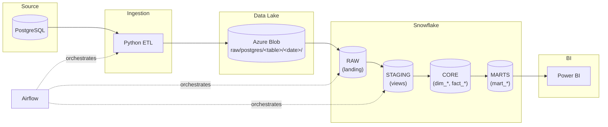
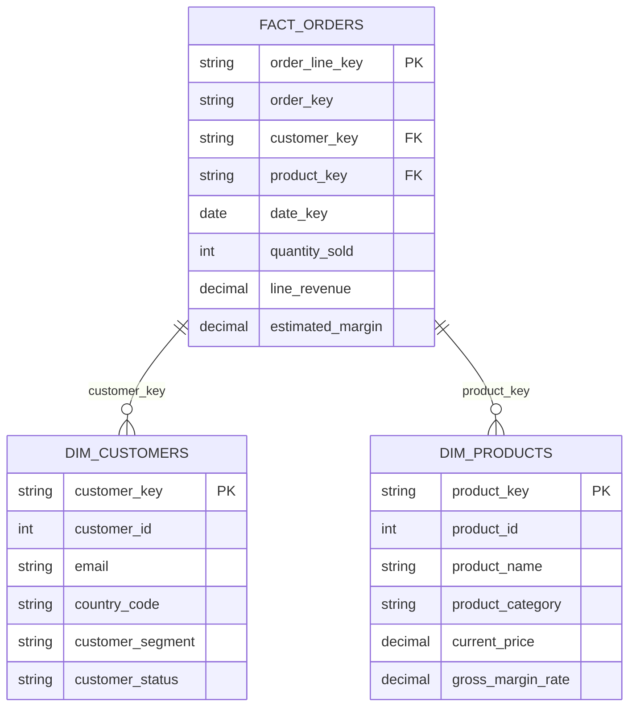

<p align="center">
  
  
  
  
  
  
  
</p>

# ShopStream — Modern Cloud Data Pipeline

A reference data pipeline for e-commerce analytics built on the Modern Data Stack: synthetic source in PostgreSQL, landed to Azure Blob as date-partitioned CSV, loaded to Snowflake, transformed by dbt into a Kimball star schema with three business marts, orchestrated by Airflow, surfaced in Power BI.

> **Status:** v2.0 (2026-04-28). See [`CHANGELOG.md`](./CHANGELOG.md) for what changed since v1.

---

## Architecture


```mermaid
flowchart LR
    subgraph Source["Source"]
        A[("PostgreSQL")]
    end
    subgraph Ingestion["Ingestion"]
        B["Python ETL"]
    end
    subgraph Lake["Data Lake"]
        C[("Azure Blob<br/>raw/postgres/&lt;table&gt;/&lt;date&gt;/")]
    end
    subgraph DWH["Snowflake"]
        D1[("RAW<br/>(landing)")]
        D2[("STAGING<br/>(views)")]
        D3[("CORE<br/>(dim_*, fact_*)")]
        D4[("MARTS<br/>(mart_*)")]
    end
    subgraph BI["BI"]
        G["Power BI"]
    end
    F["Airflow"]

    A --> B --> C --> D1 --> D2 --> D3 --> D4 --> G
    F -.->|orchestrates| B
    F -.->|orchestrates| D1
    F -.->|orchestrates| D2
```

Each Snowflake schema has one purpose:

| Schema | What lives here | Materialization |
|---|---|---|
| `RAW` | Loaded by COPY INTO from Azure Blob. Mirrors PostgreSQL 1:1, plus a `_loaded_at` audit column. | Tables |
| `STAGING` | dbt staging models: cleaning, typing, renaming. No business logic. | Views |
| `CORE` | Dimensions (`dim_customers`, `dim_products`) and facts (`fact_orders`). Surrogate keys throughout. | Tables |
| `MARTS` | Business-ready: `mart_sales_overview`, `mart_customer_ltv`, `mart_product_performance`. | Tables |

---

## Data model


```mermaid
erDiagram
    FACT_ORDERS ||--o{ DIM_CUSTOMERS : customer_key
    FACT_ORDERS ||--o{ DIM_PRODUCTS : product_key

    DIM_CUSTOMERS {
        string customer_key PK
        int customer_id
        string email
        string country_code
        string customer_segment
        string customer_status
    }
    DIM_PRODUCTS {
        string product_key PK
        int product_id
        string product_name
        string product_category
        decimal current_price
        decimal gross_margin_rate
    }
    FACT_ORDERS {
        string order_line_key PK
        string order_key
        string customer_key FK
        string product_key FK
        date date_key
        int quantity_sold
        decimal line_revenue
        decimal estimated_margin
    }
```

### Marts

| Mart | Grain | Use case |
|---|---|---|
| `mart_sales_overview` | day × country × category × segment | Daily revenue trends, BI dashboard top page. |
| `mart_customer_ltv` | one row per customer | RFM segmentation, churn risk scoring. |
| `mart_product_performance` | one row per product | Merchandising; ABC analysis. |

---

## Quick start

### Docker

```bash
git clone https://github.com/<you>/shopstream.git
cd shopstream

cp .env.example .env
# edit .env with your Azure / Snowflake credentials

docker compose up -d

# Airflow UI: http://localhost:8080  (admin / admin)
# PostgreSQL: localhost:5432         (postgres / postgres123)
```

### Manual

```bash
python -m venv venv && source venv/bin/activate
pip install -r requirements.txt

# 1. PostgreSQL: schema + data
createdb -U postgres shopstream
psql   -U postgres -d shopstream -f scripts/schema.sql
python scripts/generate_data.py

# 2. PostgreSQL -> Azure Blob
python scripts/export_to_azure_blob.py

# 3. Snowflake: setup once, then COPY INTO each day
#    Run scripts/snowflake_setup.sql in a Snowflake worksheet,
#    then scripts/snowflake_copy_into_azure.sql with the date filled in,
#    or let Airflow run scripts/run_snowflake_copy_into.py.

# 4. dbt
cd dbt_part/shopstream_dbt
dbt deps
dbt seed
dbt build              # runs models AND their tests, fail-fast
dbt docs generate
```

---

## Tests

```bash
cd dbt_part/shopstream_dbt

# Run only source-level tests (catches schema drift / load failures).
dbt test --select source:raw

# Run only model-level tests.
dbt test --select staging core marts

# `dbt build` is the canonical command: builds models and runs their tests
# in dependency order, fails the pipeline on the first test failure.
dbt build --fail-fast
```

The test suite covers `unique` and `not_null` on every PK, `relationships` on every FK between layers, and `accepted_values` on enums (order_status, plan_type, segments, abc_class).

---

## Project layout

```
shopstream/
├── airflow/
│   └── dags/shopstream_pipeline_dag.py     # Daily orchestration; uses dbt build
├── dbt_part/
│   └── shopstream_dbt/
│       ├── dbt_project.yml
│       ├── packages.yml                     # dbt_utils, dbt_expectations
│       ├── macros/generate_schema_name.sql  # schema names without target prefix
│       ├── seeds/product_margins.csv        # per-category margin (ADR-003)
│       └── models/
│           ├── staging/  stg_users, stg_products, stg_orders, stg_order_items
│           ├── core/     dim_customers, dim_products, fact_orders
│           └── marts/    mart_sales_overview, mart_customer_ltv, mart_product_performance
├── scripts/
│   ├── schema.sql                           # PostgreSQL: 4 tables
│   ├── generate_data.py                     # Faker -> PostgreSQL
│   ├── export_to_azure_blob.py                      # PostgreSQL -> Azure Blob (CSV)
│   ├── snowflake_setup.sql                  # DB, schemas, warehouses, raw tables
│   ├── snowflake_copy_into_azure.sql        # Azure Blob -> RAW.RAW_*
│   ├── run_snowflake_copy_into.py          # Executes COPY INTO for Airflow
│   └── snowflake_verify_data.sql            # smoke tests + consistency checks
├── docs/
│   ├── adr/                                 # Architecture Decision Records
│   ├── Vue d'ensemble.png                   # Power BI: overview
│   └── Analyse Clients.png                  # Power BI: customer analysis
├── docker-compose.yml
├── CHANGELOG.md
└── README.md
```

---

## Architecture decisions

Non-obvious choices are recorded in [`docs/adr/`](./docs/adr/). 

- [ADR-001](./docs/adr/0001-raw-vs-staging-naming.md) — Raw vs. staging: naming and schema separation
- [ADR-002](./docs/adr/0002-surrogate-keys.md) — Surrogate keys on dimensions and facts
- [ADR-003](./docs/adr/0003-margin-via-seed.md) — Margin estimation via a versioned seed file
- [ADR-004](./docs/adr/0004-azure-blob-instead-of-s3.md) — Azure Blob Storage instead of AWS S3 for the data lake layer
- [ADR-005](./docs/adr/0005-github-actions-ci.md) — GitHub Actions CI pipeline
- [ADR-006](./docs/adr/0006-incremental-fact-orders.md) — Incremental materialization for fact_orders

---

## Roadmap

**v2.1** (planned):

- GitHub Actions CI: `sqlfluff` + `ruff` on PR, `dbt build` against an isolated CI schema
- Slack webhook on Airflow failure and on dbt test failure
- Cost-tracking mart over `SNOWFLAKE.ACCOUNT_USAGE.WAREHOUSE_METERING_HISTORY`
- Re-introduce `events` (VARIANT-typed engagement events) and `crm_contacts` (marketing attribution) with proper modeling
- Incremental materialization on `fact_orders`
- CSV → Parquet for the Azure Blob landing layer

**v3.0** (later):

- Streaming ingestion via Snowpipe Streaming + Dynamic Tables
- A small RAG-based analyst assistant over the docs and the marts (Snowflake Cortex)

---

## License

[MIT](./LICENSE)

---

## Author

Abdelali Amassaghrou — Data/AI Engineer.
